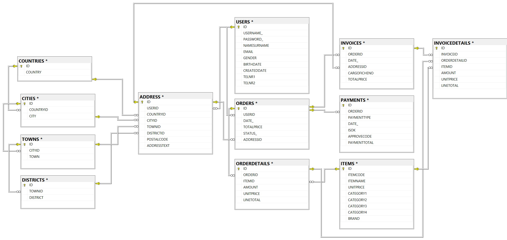

# E-Trade İlişkisel Veritabanı Mimarisi ve Müşteri Analitiği (MS SQL)

Normalize edilmiş bir e-ticaret ilişkisel veritabanı mimarisinin kurgulanması, veri bütünlüğü doğrulamaları ve 500.000'den fazla işlem kaydı üzerinden yürütülen iş zekası odaklı analitik SQL çalışmalarını içerir.

---

## Veritabanı Mimarisi (ER Diyagramı)

Sistem, birbiriyle ilişkilendirilmiş olmak üzere 12 tablodan oluşmaktadır:

---

## Proje Dosyaları

| Dosya Adı | Açıklama |
| :--- | :--- |
| **`schema_only_setup.sql`** | 12 tablonun şema tanımlarını (DDL), birincil (PK) ve yabancı anahtar (FK) kısıtlamalarını içeren kurulum dosyası. |
| **`musteri_analitigi.sql`** | Pareto analizi, satış trendleri ve ürün fiyat metriklerini hesaplayan optimize SQL sorguları. |
| **`database_diagram.jpg`** | Veritabanı bağlantılarını gösteren Varlık İlişki Diyagramı (ERD). |

> **Not:** GitHub dosya boyutu sınırları nedeniyle 500.000+ satırlık üretim verisi eklenememiştir. Veritabanı iskeleti ve ilişkisel bütünlük kuralları `schema_only_setup.sql` dosyasında eksiksiz yapılandırılmıştır.

---

## Kullanılan Teknolojiler

* **Veritabanı Yönetim Sistemi:** MS SQL Server
* **Geliştirme Araçları:** SQL Server Management Studio (SSMS), VS Code
* **Versiyon Kontrolü:** Git, GitHub
